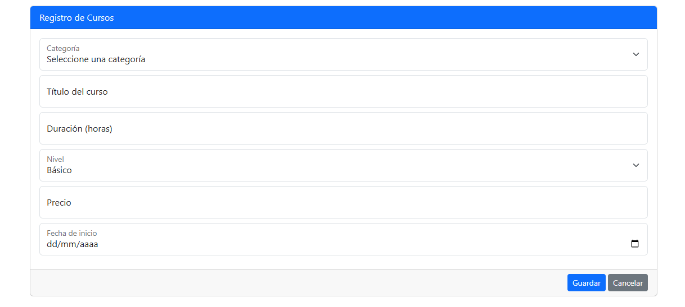

# Proyecto CRUD de Cursos

## Descripción

Este proyecto es una aplicación que permite gestionar cursos. Está hecha en PHP y utiliza una base de datos MySQL para almacenar información sobre categorías y cursos.

## Avance hasta ahora

Hasta ahora he logrado completar la parte de **registrar cursos**. Esto quiere decir que:

- Se pueden registrar cursos en la base de datos.
- Las categorías se cargan dinámicamente en el formulario de registro (son traídas de la base de datos).
- El formulario permite ingresar el nombre del curso, categoría, duración, nivel, precio y fecha de inicio.

## ¿Qué falta por hacer?

1. Crear la funcionalidad para **listar los cursos** registrados.
2. Agregar la opción de **editar cursos** ya existentes.
3. Agregar la opción de **eliminar cursos**.

